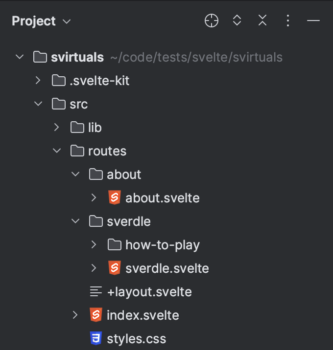
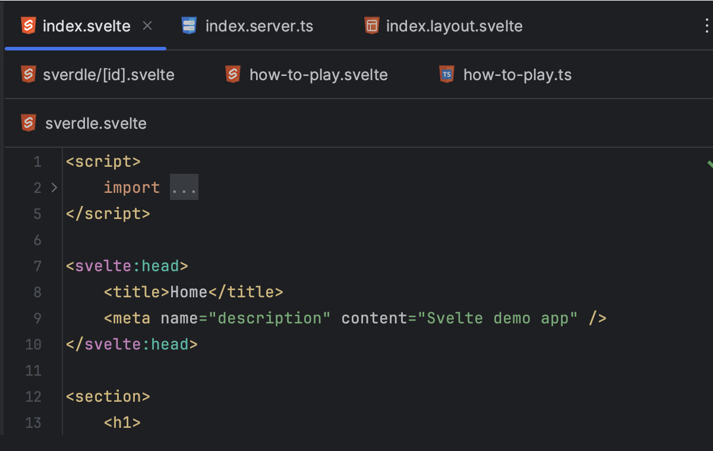
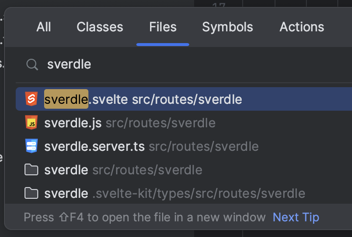

# VirtualKit

An Intellij plugin to modify the SvelteKit project tree to make it easier to navigate between files.

## Features

### Route files are respresented by name

- +page.svelte is modified to {route}.svelte
- +page.server.js is modified to {route}.server.js
- +page.js is modified to {route}.js
- +layout.svelte is modified to {route}.layout.svelte
- +error.svelte is modified to {route}.error.svelte

Same for ts files

### Nesting

+page.server.js and +page.js are nested under +page.svelte

### Tabs

The tab titles are modified to show the route name

### Goto file

The goto file dialog is modified to show the new file names

## Todo

- [x] Add a setting toggle nesting
- [x] Handle layout files
- [x] Handle routes with params
- [x] Extend file search